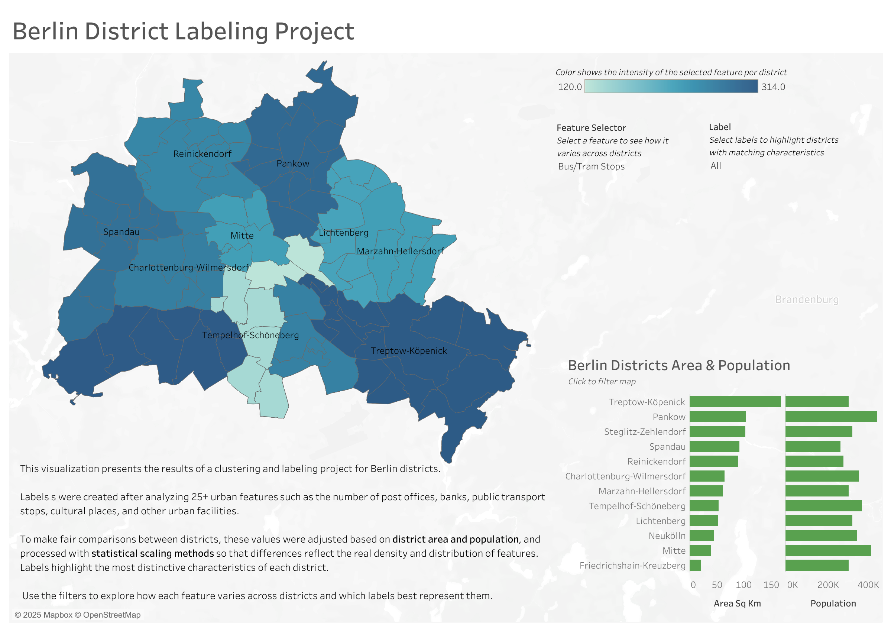

#  Berlin District Labeling Project

This project explores Berlin’s districts through data scraping, feature engineering, and labeling analysis.
The goal was to create data-driven district profiles and identify distinct urban typologies based on 25+ socio-spatial indicators such as transport, culture, and public services.

## Overview
- **Goal:** Identify key urban characteristics and group districts based on shared patterns.  
- **Data:** Collected from open Berlin city datasets (Open Street Map, Open Data Berlin, Geoportal Berlin, and others).  

 
## Tech Stack
- **Languages:** Python, SQL  
- **Libraries:** pandas, geopandas, numpy, matplotlib  
- **Visualization:** Tableau  
- **Database:** PostgreSQL
- **Version control:** GitHub

##  Project Summary
- Data was collected from public APIs and open datasets
- SQL tables (`district_attributes`, `district_features`, `districts_labels`) were created in AWS and managed via DBeaver
- Feature engineering included density-based normalization by district area and population
- District labels were created through clustering and manual interpretation
- Visualization was built in Tableau Public

##  Repository Structure
| Folder | Description |
|---------|--------------|
| `features/` | Feature engineering logic, SQL, normalization |
| `labels/` | Label creation process, scripts, and descriptions |
| `labeling_documantation/` | Documentation of labeling logic |
| `scraping/` | Web scraping scripts and raw data |
| `tableau/` | The final visualization|

##  Methods
Statistical scaling and normalization were applied to make fair feature comparisons across districts.  
Labels reflect the most distinctive social, cultural, and infrastructural patterns of each area.   
Detailed labeling logic is described in [labeling_documentation/README.md](labeling_documentation/README.md).

##  Tableau Dashboard
**Dashboard Preview**

The final visualization is available on [Tableau Public](https://public.tableau.com/app/profile/sotnichenko.serhii/viz/BerlinDistricts/BerlinDistrictLabelingProject).  
It allows users to explore how each feature varies across Berlin’s districts and which labels best represent them.

##  Author
Created by **Serhii Sotnichenko** and **Yana Yelnikova** as part of a data analytics internship project (2025).
